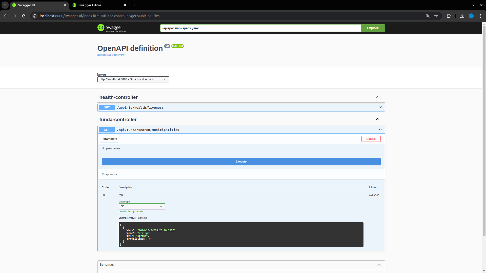

# funda-scraper

Scraping general municipality property sales data from Funda (a Dutch website for selling/renting property)

## Requirements

To build the runnable jar you will need:

* Java 21+
* Apache Maven

## How to build

Go to the project directory and run the following command:

```
$ mvn clean package  
```

This will result in a jar file in the project sub dir:

```
application/target/application-0.0.1-SNAPSHOT.jar
```

## Run

You can run the program by running the command after the building process using the following
command:

```
$ java -jar application/target/application-0.0.1-SNAPSHOT.jar
```

## Usage

Open your browser and use the following link:
[http://localhost:8080/swagger-ui/index.html](http://localhost:8080/swagger-ui/index.html)

Searchable areas can be found
on [funda](https://www.funda.nl/koop/bladeren/heel-nederland/?actpnl=Plaatsnaam)

You will get web-interface to request a scraping of an area:


That will result if used correctly to a result in json format that looks like:

```
[
   {
    "date": "2024-10-24T06:24:12.698+00:00",
    "name": "Oirsbeek",
    "url": "/koop/oirsbeek/",
    "nrOfListings": 9
  },
  {
    "date": "2024-10-24T06:24:12.698+00:00",
    "name": "Oostknollendam",
    "url": "/koop/oostknollendam/",
    "nrOfListings": 9
  },
  {
    "date": "2024-10-24T06:24:12.698+00:00",
    "name": "Otterlo",
    "url": "/koop/otterlo/",
    "nrOfListings": 9
  },
  {
    "date": "2024-10-24T06:24:12.698+00:00",
    "name": "Oudeschild",
    "url": "/koop/oudeschild/",
    "nrOfListings": 9
  },
  {
    "date": "2024-10-24T06:24:12.698+00:00",
    "name": "Pannerden",
    "url": "/koop/pannerden/",
    "nrOfListings": 9
  },
  {
    "date": "2024-10-24T06:24:12.698+00:00",
    "name": "Rilland",
    "url": "/koop/rilland/",
    "nrOfListings": 9
  },
  {
    "date": "2024-10-24T06:24:12.698+00:00",
    "name": "Schimmert",
    "url": "/koop/schimmert/",
    "nrOfListings": 9
  },
  {
    "date": "2024-10-24T06:24:12.698+00:00",
    "name": "Serooskerke (Gem. Veere)",
    "url": "/koop/serooskerke-gem-veere/",
    "nrOfListings": 9
  },
  {
    "date": "2024-10-24T06:24:12.698+00:00",
    "name": "Sint Nicolaasga",
    "url": "/koop/sint-nicolaasga/",
    "nrOfListings": 9
  },
  {
    "date": "2024-10-24T06:24:12.698+00:00",
    "name": "Stolwijk",
    "url": "/koop/stolwijk/",
    "nrOfListings": 9
  },
  {
    "date": "2024-10-24T06:24:12.698+00:00",
    "name": "Terborg",
    "url": "/koop/terborg/",
    "nrOfListings": 9
  },
  {
    "date": "2024-10-24T06:24:12.698+00:00",
    "name": "Thorn",
    "url": "/koop/thorn/",
    "nrOfListings": 9
  },
  {
    "date": "2024-10-24T06:24:12.698+00:00",
    "name": "Tubbergen",
    "url": "/koop/tubbergen/",
    "nrOfListings": 9
  },
  {
    "date": "2024-10-24T06:24:12.698+00:00",
    "name": "Veen",
    "url": "/koop/veen/",
    "nrOfListings": 9
  },
  {
    "date": "2024-10-24T06:24:12.698+00:00",
    "name": "Vledder",
    "url": "/koop/vledder/",
    "nrOfListings": 9
  },
  {
    "date": "2024-10-24T06:24:12.698+00:00",
    "name": "Vlodrop",
    "url": "/koop/vlodrop/",
    "nrOfListings": 9
  },
  {
    "date": "2024-10-24T06:24:12.698+00:00",
    "name": "Vreeland",
    "url": "/koop/vreeland/",
    "nrOfListings": 9
  },
  {
    "date": "2024-10-24T06:24:12.698+00:00",
    "name": "Warder",
    "url": "/koop/warder/",
    "nrOfListings": 9
  },
  {
    "date": "2024-10-24T06:24:12.698+00:00",
    "name": "Well (LI)",
    "url": "/koop/well-li/",
    "nrOfListings": 9
  },
  {
    "date": "2024-10-24T06:24:12.698+00:00",
    "name": "Westwoud",
    "url": "/koop/westwoud/",
    "nrOfListings": 9
  }
]
```

## History

This project is created as an example of how to collect a dataset from a website for the purpose of
usage in machine-learning due to the lack of ways of actually collecting data and doing this in
Java!
It is inspired by a similar project written in Python https://github.com/whchien/funda-scraper. The
reason this project was created is my need for datasets to use in my study and ML-endeavours as
Funda seems to be a useful website full of dirty-data that is relevant for enhancing a programmers
skill in acquiring and using scraped data.

## Disclaimer

Funda-Scaper provides a REST-interface to scrape datasets from Funda, the Dutch housing website for
non-commercial use.

## License

Dear user,

Thank you for your interest in [funda-scraper]. We would like to inform you about the licensing
conditions that govern the use, modification, and distribution of our software.

[funda-scraper] is licensed under the GNU Affero General Public License (AGPL). This is a free
software license that allows you to:

1) Use the software for any purpose that does not harm funda in any way.
2) Study and modify the source code.
3) Distribute the software to others.
4) Share modifications and improvements with the community.
   However, there are certain conditions you need to be aware of:

* If you modify and distribute the software, you must disclose your changes and make the modified
  source code available. This ensures that improvements and modifications benefit everyone.

* If you run a modified program on a server and let other users communicate with it there, your
  server must also allow them to download the modified source code. This ensures that users can
  benefit from improvements even if they're only interacting with the software over a network.

* You cannot sublicense the software. Any user who gets the software (either the original or a
  modified version) directly or indirectly from you will have the same rights you did, under the
  same terms.

* The AGPL is designed to ensure that everyone benefits from the software and any improvements made
  to it, whether those improvements are made public or are used internally on a networked server.

Please ensure that you fully understand and comply with the terms of the AGPL when using, modifying,
or distributing [funda-scraper]. The full text of the AGPL can be found at the official GNU website.

Thank you for respecting our choice of license, and we hope you find [funda-scraper] valuable for
your needs.

### Please note:

Scraping this website is only allowed for personal use (as per Funda's Terms and Conditions).
Any commercial use of this package is prohibited. The author holds no liability for any
misuse of the program.